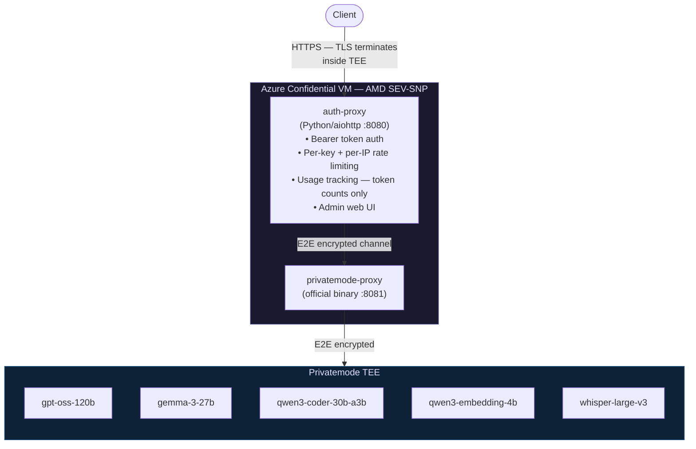

[](https://github.com/Open-Paws/privatemode-proxy)
[](LICENSE)
[](https://www.python.org/)
[](https://github.com/Open-Paws/desloppify)
[](tests/)
[](https://openpaws.ai)

# privatemode-proxy

An OpenAI-compatible API proxy for [Privatemode](https://privatemode.ai) that runs inside an Azure Confidential VM with AMD SEV-SNP hardware encryption. It provides a zero-retention AI endpoint — all traffic is end-to-end encrypted, prompt content is never written to disk or logs, and TLS terminates inside hardware-isolated memory that the cloud provider cannot access.

Standard cloud AI APIs retain prompts for abuse monitoring or legal compliance. For investigators and activists working on factory farm exposés, witness protection, or legal defense strategy, that retention creates direct exposure to state surveillance, corporate infiltration, and legal discovery. This proxy eliminates that exposure while keeping full OpenAI API compatibility — any client that supports a custom `base_url` works without code changes.

> [!NOTE]
> This project is part of the [Open Paws](https://openpaws.ai) ecosystem — AI infrastructure for the animal liberation movement. [Explore the full platform →](https://github.com/Open-Paws)

## Architecture



The key security property: TLS terminates inside AMD SEV-SNP encrypted memory. Azure's hypervisor and infrastructure staff cannot access decrypted traffic, TLS private keys, or API secrets — CPU hardware enforces this isolation.

## Quickstart

```bash
# 1. Copy and configure environment
cp .env.example .env
# Edit .env: set ADMIN_PASSWORD and PRIVATEMODE_API_KEY

# 2. Build the container
docker build -t privatemode-proxy:latest .

# 3. Run in HTTP mode (local development — no TLS required)
docker run -d --name privatemode \
  -p 8080:8080 \
  --env-file .env \
  privatemode-proxy:latest

# 4. Verify
curl http://localhost:8080/health

# 5. Run tests
pip install -r requirements-test.txt && pytest
```

For production deployment on Azure Confidential Computing, see [docs/azure-deployment.md](docs/).

## Features

### API Endpoints

All endpoints require `Authorization: Bearer YOUR_KEY` except `/health`.

| Method | Endpoint | Description |
|--------|----------|-------------|
| `POST` | `/v1/chat/completions` | Chat with AI models |
| `POST` | `/v1/embeddings` | Generate text embeddings for RAG and semantic search |
| `POST` | `/v1/audio/transcriptions` | Speech-to-text via Whisper |
| `GET` | `/v1/models` | List available models |
| `GET` | `/health` | Health check (no auth required) |
| `GET` | `/admin` | Admin web UI (password auth) |

### Available Models

| Model ID | Type | Description |
|----------|------|-------------|
| `gpt-oss-120b` | Chat | Large general-purpose model |
| `gemma-3-27b` | Chat | Google Gemma 3 27B |
| `qwen3-coder-30b-a3b` | Chat | Code generation |
| `qwen3-embedding-4b` | Embeddings | Vector search and RAG |
| `whisper-large-v3` | Audio | Speech-to-text transcription |

### Encryption Model

- **Hardware isolation** — AMD SEV-SNP encrypts all VM memory at the CPU level; Azure cannot read it
- **Zero-retention** — prompt content (`choices` field) is never written to disk, logs, or external services; only token counts are stored per API key
- **TLS inside TEE** — TLS terminates inside the encrypted enclave; keys never exist in Azure-accessible memory
- **Attestation** — the workload verifies it is running in a genuine SEV-SNP enclave on startup (`level=INFO msg="Validate succeeded" validator.name=snp-0-GENOA`)

### Deployment

- Single Docker container (multi-stage build: official Privatemode binary + Python 3.12-slim)
- Two processes managed by supervisord: `auth-proxy` on port 8080 and `privatemode-proxy` on port 8081
- Non-root user (`appuser`, UID 1000)
- Hot-reload API key rotation without restart
- Per-key and per-IP rate limiting with configurable windows
- Let's Encrypt TLS with automatic renewal via certbot systemd timer

### OpenAI Compatibility

Any client that supports a custom `base_url` works without code changes — n8n, Zapier, Make, LangChain, LlamaIndex, and direct SDK usage:

```python
from openai import OpenAI

client = OpenAI(
    base_url="https://your-proxy-domain.com/v1",
    api_key="your-proxy-api-key"
)
```

### Pricing (via Privatemode)

| Type | Price |
|------|-------|
| Chat models | €5.00 per 1M tokens |
| Embeddings | €0.13 per 1M tokens |
| Speech-to-text | €0.096 per megabyte |

## Documentation

- [Azure deployment guide](docs/) — step-by-step Confidential VM setup
- [Configuration reference](#configuration-reference) — all environment variables
- [Admin panel](#admin-panel) — key management, usage dashboard, settings
- [Security model](#security-model) — what Azure can and cannot access
- [CLAUDE.md](CLAUDE.md) — development guide and architecture decisions

## Architecture

<details>
<summary>Expand — component details, zero-retention invariant, defense-in-depth layers</summary>

### Component Overview

```
privatemode-proxy/
├── Dockerfile              # Multi-stage: extracts Privatemode binary, Python 3.12-slim, non-root
├── supervisord.conf        # Runs auth-proxy + privatemode-proxy in one container
├── .env.example            # Environment variable template
├── pytest.ini              # Test config (asyncio mode)
├── requirements-test.txt   # Test dependencies
├── auth-proxy/
│   ├── server.py           # Main proxy — request routing, TLS, HTTPS enforcement
│   ├── admin.py            # Admin web UI — key management, usage dashboard, settings
│   ├── config.py           # Centralized configuration from environment variables
│   ├── key_manager.py      # API key CRUD, validation, hot-reload from JSON
│   ├── usage_tracker.py    # Token usage and cost tracking per key/model
│   ├── utils.py            # Shared utilities
│   ├── requirements.txt    # Runtime dependencies (aiohttp, aiohttp-cors, cryptography)
│   └── static/             # Admin UI static assets
├── tests/                  # 116 tests across auth, admin, endpoints, proxy, rate limiting
├── scripts/
│   ├── manage_keys.py      # CLI for API key management
│   └── scrape_docs.py      # Scrapes Privatemode docs into docs/
└── docs/                   # Scraped Privatemode docs + Azure deployment guide
```

### Zero-Retention Invariant

Prompts and responses are never written to disk or any log stream. The proxy reads only the `usage` field from Privatemode's responses and discards `choices` entirely:

```json
{
  "choices": [...],          // ignored — actual conversation content
  "usage": {
    "prompt_tokens": 25,     // recorded for cost tracking
    "completion_tokens": 150,
    "total_tokens": 175
  }
}
```

This is a core security invariant, not a configuration option. Any PR that adds logging of request or response content is a Tier 3 security incident.

### Defense-in-Depth Layers

1. **Hardware** — AMD SEV-SNP encrypts all VM memory at the CPU level
2. **OS** — Ubuntu with Secure Boot and vTPM verify boot integrity
3. **Container** — non-root user (`appuser`, UID 1000), minimal Python 3.12-slim base
4. **Application** — HTTPS enforcement, Bearer token auth, per-key and per-IP rate limiting
5. **Key management** — hot-reload key rotation, optional per-key expiration and rate limits

### Security Model: What Azure Can and Cannot Access

| Component | Azure access | Notes |
|-----------|-------------|-------|
| VM memory | No | CPU-encrypted, Azure has no keys |
| TLS private key | No | Generated on VM, lives in encrypted memory only |
| Privatemode API key | No | Passed via env var, stays in encrypted memory |
| Decrypted API traffic | No | TLS terminates inside the TEE |
| Encrypted network traffic | Yes | Before TLS termination at the VM NIC |
| VM metadata | Yes | Name, size, region, resource group |
| Resource metrics | Yes | CPU, memory, network usage aggregates |

### Configuration Reference

| Variable | Required | Default | Description |
|----------|----------|---------|-------------|
| `PRIVATEMODE_API_KEY` | Yes | — | Your Privatemode API key |
| `ADMIN_PASSWORD` | Yes | — | Password for admin web UI |
| `API_KEYS_FILE` | No | `/app/secrets/api_keys.json` | Path to API keys JSON |
| `TLS_CERT_FILE` | No | — | Path to TLS certificate (enables HTTPS when set) |
| `TLS_KEY_FILE` | No | — | Path to TLS private key |
| `FORCE_HTTPS` | No | `true` when TLS enabled | Reject non-HTTPS requests |
| `TRUST_PROXY` | No | `false` | Trust `X-Forwarded-*` headers from a reverse proxy |
| `RATE_LIMIT_REQUESTS` | No | `100` | Global rate limit (requests per window) |
| `RATE_LIMIT_WINDOW` | No | `60` | Rate limit window in seconds |
| `IP_RATE_LIMIT_REQUESTS` | No | `1000` | Per-IP rate limit |
| `IP_RATE_LIMIT_WINDOW` | No | `60` | Per-IP rate limit window in seconds |
| `PORT` | No | `8080` | Port to listen on |
| `UPSTREAM_URL` | No | `http://localhost:8081` | URL for Privatemode binary |

### Admin Panel

Access at `https://yourdomain.com/admin` with your `ADMIN_PASSWORD`.

- **API Keys** — generate keys with optional expiration and per-key rate limits, view status, revoke or delete instantly
- **Settings** — verify Privatemode upstream connection, configure global and per-IP rate limits
- **Usage & Costs** — total spend in Euros for any period, token usage by API key and model
- **Documentation** — in-app reference for encryption model, code examples, model and pricing reference

</details>

## Contributing

Investigators and activists depend on this proxy for privacy-critical work. Contributions that strengthen the security model, expand model support, or improve operational reliability are welcome.

Before submitting a PR:

1. Read the existing code — understand the zero-retention invariant before touching anything in `server.py` or `usage_tracker.py`
2. Write failing tests first; run `pytest` before and after your changes
3. Run quality gates:
   ```bash
   desloppify scan --path .   # minimum score ≥85
   semgrep --config semgrep-no-animal-violence.yaml .
   pytest
   ```
4. Security changes (auth, TLS, rate limiting, logging) require explicit security review in the PR — tag them clearly
5. The zero-retention invariant is non-negotiable: no PR may add logging of request or response content

See [CLAUDE.md](CLAUDE.md) for the full development guide, architecture decisions, and organizational context.

## Intended Users

- **Investigators and activists** using AI to analyze investigation documentation, draft reports, or process field data — where standard cloud AI APIs would expose content to retention
- **Campaigns** running automated AI workflows (n8n, Zapier, Make) that need zero-retention AI processing
- **Coalitions** building shared tooling where member organizations have strict data handling requirements
- **Open Paws developers** building platform features that process Tier 3 data (investigation documentation, witness identity data, legal defense materials)

If you are processing data that could identify activists, document investigations, or support legal defense — route it through this proxy, not through any cloud AI provider with data retention.

## License

MIT — Copyright (c) 2024–2026 Open Paws. See [LICENSE](LICENSE).

### Acknowledgments

- [Privatemode](https://privatemode.ai) and [Edgeless Systems](https://edgeless.systems) for the TEE-based confidential AI infrastructure
- [Azure Confidential Computing](https://azure.microsoft.com/en-us/solutions/confidential-compute/) for AMD SEV-SNP Confidential VMs

<!-- metadata
tech_stack: Python 3.12, aiohttp, Docker, supervisord, Azure Confidential Computing, AMD SEV-SNP
project_status: production
difficulty: intermediate
skill_tags: security, privacy, confidential-computing, api-proxy, openai-compatible, docker, azure
related_repos: platform, gary
-->

---

[Donate](https://openpaws.ai/donate) · [Discord](https://discord.gg/openpaws) · [openpaws.ai](https://openpaws.ai) · [Volunteer](https://openpaws.ai/volunteer)
